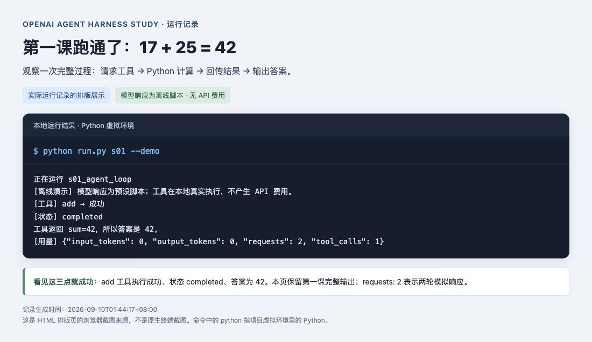
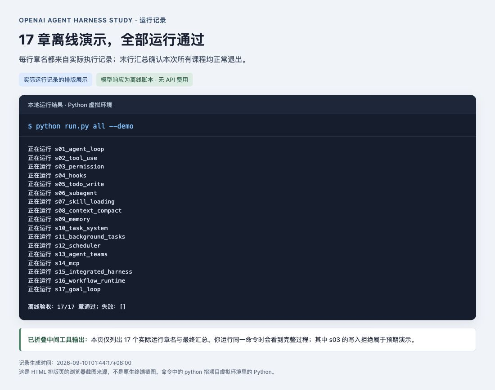
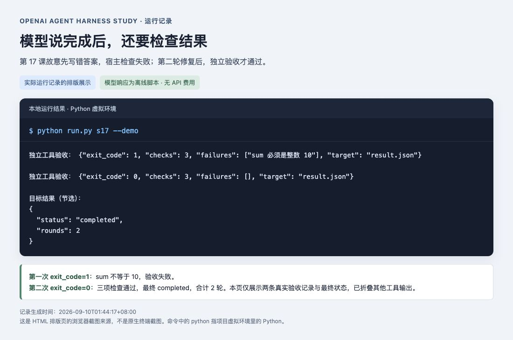

# 从零学会 AI Agent：OpenAI 中文实战教程

**17 章中文讲解 + 可运行 Python 示例 + 小白图文指南。先不用 API Key，也能跑通第一课。**

[📖 从这里开始：小白安装指南](docs/GETTING_STARTED.md) · [📥 下载 ZIP](https://github.com/yunerjun4869-cmd/openai-agent-harness-study/archive/refs/heads/main.zip) · [🗂 17 章目录](SUMMARY.md)

## 这到底是什么？

这是一本可以在电脑上“边读、边运行”的 AI Agent 学习手册。
它用 OpenAI 的工具调用接口，教你做一个能够调用函数、读写文件、安排任务并检查结果的 AI 助手。

**举个例子：**你让 AI 计算 `17 + 25`。它先请求调用 `add` 工具，Python 真正执行加法，把 `42` 交回 AI，最后由 AI 给出回答。后面的课程会把工具换成文件操作、记忆、后台任务和多个助手协作。

| 你关心的问题 | 直接回答 |
|---|---|
| 适合谁？ | 想了解 AI Agent 的学生、产品经理、独立开发者、转型 AI 的工程师；不懂代码也能先跟着步骤运行演示 |
| 学会后能做什么？ | 看懂工具调用的完整过程，修改工具和任务规则，逐步搭建自己的 Agent 原型 |
| 一定要会 Python 吗？ | 第一遍运行不要求你会写代码；修改代码前建议学会变量、函数和列表 |
| 需要哪些东西？ | 一台 Mac 或 Windows 电脑、Python 3.11 或以上版本、首次安装依赖时能联网 |
| 第一课需要付费吗？ | `--demo` 使用预设模型响应，不需要 API Key，不产生 OpenAI API 费用 |
| 能接真正的模型吗？ | 可以。完成离线学习后配置自己的 OpenAI API Key，再去掉 `--demo`；真实请求按 API 账户规则计费 |
| 是什么形式？ | 中文 Markdown 文档和终端里的 Python 程序；“终端”就是输入命令并查看运行结果的窗口 |
| 与 Claude Code 有什么关系？ | 课程顺序参考开源学习项目，代码重写为 OpenAI Responses API；这是非官方教学项目 |

## 先看看跑起来是什么样

下图是**实际运行记录的排版展示页面截图**。文字来自本项目的真实离线执行；模型回复是预设脚本，Python 工具确实运行。



看到 `add → 成功`、`completed` 和 `42`，就说明第一课的工具调用流程已经跑通。

## 完全小白：按这 5 步开始

| 步骤 | 要做什么 | 完成标志 |
|---|---|---|
| 1. 下载 | 点上方“下载 ZIP”，或仓库绿色 `Code` → `Download ZIP`，再解压 | 得到 `openai-agent-harness-study-main` 文件夹 |
| 2. 安装 Python | 从 [python.org](https://www.python.org/downloads/) 安装 Python 3.11 或以上版本 | 终端能显示 Python 版本 |
| 3. 打开项目目录 | 打开终端，进入解压后的文件夹 | 当前文件夹里能看到 `run.py` |
| 4. 安装项目依赖 | 按下方对应系统的命令建立 `.venv`，再安装依赖 | 安装命令正常结束，没有红色报错 |
| 5. 跑第一课 | 执行带 `--demo` 的命令 | 看到工具成功、状态 completed、结果 42 |

**不知道“打开终端”“进入文件夹”是什么意思？请直接看 [逐步图文新手指南](docs/GETTING_STARTED.md)，里面把每一次操作拆开说明。**

### Mac：进入项目文件夹后，逐行复制

先按 `Command + 空格` 搜索“终端”并打开。在终端输入 `cd` 和一个空格，把解压后的项目文件夹拖进去，按回车。
然后逐行运行，每一行执行结束再输入下一行：

```bash
python3 --version
python3 -m venv .venv
.venv/bin/python -m pip install -r requirements-dev.txt
.venv/bin/python run.py s01 --demo
```

### Windows：进入项目文件夹后，逐行复制

在资源管理器打开解压后的项目文件夹，点击顶部地址栏，输入 `powershell`，按回车。
安装 Python 时建议勾选 **Add python.exe to PATH**。然后逐行执行：

```powershell
py --version
py -m venv .venv
.venv\Scripts\python.exe -m pip install -r requirements-dev.txt
.venv\Scripts\python.exe run.py s01 --demo
```

如果 `py` 找不到，而 `python --version` 正常，可把前两行的 `py` 换为 `python`。
两个系统都直接调用项目自己的 Python，无需先执行虚拟环境激活脚本。

## 下一步怎么学？

**一次只学一章：先读该章 README，再运行示例，最后尝试文末练习。** 把命令里的 `s01` 改为 `s02` 就能学第二课。
下表命令以 Mac 为例；Windows 把 `.venv/bin/python` 换成 `.venv\Scripts\python.exe`。

| 目的 | 命令 |
|---|---|
| 看全部章节 | `.venv/bin/python run.py --list` |
| 跑第二课 | `.venv/bin/python run.py s02 --demo` |
| 跑全部离线演示 | `.venv/bin/python run.py all --demo` |
| 看权限拒绝与允许的区别 | 先跑 `s03 --demo`，再跑 `s03 --demo --allow-write` |
| 看 AI“自称完成”如何被验收否决 | `.venv/bin/python run.py s17 --demo` |
| 检查本地机制 | `.venv/bin/python -m pytest -q` |

下次学习只需重新进入项目文件夹，直接运行课程；不用重复创建 `.venv` 和安装依赖。
离线模型的回答是固定脚本，自定义问题要在配置 API Key 后用真实模式尝试。



## 17 章分别学什么？

| 章节 | 主题 | 用大白话解释 |
|---|---|---|
| [s01](s01_agent_loop/README.md) | 工具调用循环 | 让 AI 请求 Python 帮它算数，再拿回结果 |
| [s02](s02_tool_use/README.md) | 多工具 | 给助手增加列文件、读文件等能力 |
| [s03](s03_permission/README.md) | 权限 | AI 想改文件时，由程序判断是否允许 |
| [s04](s04_hooks/README.md) | Hooks | 在执行前后插入检查和日志 |
| [s05](s05_todo_write/README.md) | 待办计划 | 先列步骤，再更新进行状态 |
| [s06](s06_subagent/README.md) | 子助手 | 把一件小事交给独立助手 |
| [s07](s07_skill_loading/README.md) | 技能 | 用到某份说明时再读取它 |
| [s08](s08_context_compact/README.md) | 上下文 | 对话太长时整理旧内容，保留完整工具链 |
| [s09](s09_memory/README.md) | 记忆 | 保存带来源的信息，下次还能找到 |
| [s10](s10_task_system/README.md) | 持久化任务 | 保存任务进度，避免多个助手重复领取 |
| [s11](s11_background_tasks/README.md) | 后台执行 | 慢任务放后台，其他工作继续 |
| [s12](s12_scheduler/README.md) | 到期调度 | 到了指定时间再执行已保存的任务 |
| [s13](s13_agent_teams/README.md) | 多助手协作 | 多个助手在独立目录里分工 |
| [s14](s14_mcp/README.md) | 远程 MCP | 连接外部工具，调用前明确审批 |
| [s15](s15_integrated_harness/README.md) | 综合实践 | 把文件、权限、审计、任务和预算连起来 |
| [s16](s16_workflow_runtime/README.md) | 故障恢复 | 中途失败后，从已保存的进度继续 |
| [s17](s17_goal_loop/README.md) | 目标验收 | 让真实检查结果决定任务是否完成 |



## 可选：接入真正的 OpenAI 模型

建议先跑通离线第一课，再配置。**API Key 是程序调用模型的凭证，不是你的登录密码。**

1. 在项目里把 `.env.example` 复制一份，命名为 `.env`。
2. 用纯文本编辑器打开 `.env`，在 `OPENAI_API_KEY=` 后填入你自己的 OpenAI API Key。
3. 把 `OPENAI_MODEL` 设置为账户可用且支持 Responses 工具调用的模型。
4. 保存文件，运行第一课，把命令末尾的 `--demo` 去掉。

```bash
# Mac，已完成上面的配置后执行：
.venv/bin/python run.py s01
```

Windows 对应命令为 `.venv\Scripts\python.exe run.py s01`。
密钥不要发给别人、放进截图或上传 GitHub；`.env` 已设置为 Git 忽略。
Key 获取入口、隐藏文件、`.env.txt` 等问题详见 [新手指南的真实模型部分](docs/GETTING_STARTED.md)。

模型发起的修改工具默认需要授权。真实交互模式会显示参数供确认；`--allow-write` 可显式授权本章的修改工具。
宿主仍会创建工作目录和数据库，s16 会按固定流程写报告；这与模型工具的审批是不同环节。
基础循环的 `completed` 表示模型会话结束；只有 s17 的独立检查器能判定其示例目标验收通过。

## 常见问题：先看这里

| 遇到什么 | 怎么处理 |
|---|---|
| `python3` / `py` 找不到 | 安装 Python 后关掉并重新打开终端，先检查版本 |
| `can't open file ... run.py` | 没进入正确文件夹；确认当前目录里确实有 `run.py` |
| `No module named ...` | 用命令中的 `.venv` Python 安装依赖，再用同一个 Python 运行 |
| 提示缺少 `OPENAI_API_KEY` | 只是想学习就加 `--demo`；想调用真实模型则按上面配置 |
| 看见 `PermissionDenied` | s03 默认故意展示拒绝写入，这也是正常教学结果 |
| 真实模型提示 `incomplete` 或其他失败 | 不会自动算成功；按 [详细排错表](docs/GETTING_STARTED.md) 检查配置、模型与预算 |

## 代码质量与实际范围

本地验证结果：**66 项测试通过，17/17 章离线演示通过**。实际验收环境为 macOS + Python 3.13.5。
Windows 提供操作指南，但尚未在 Windows 上完整实测；部分符号链接测试需要系统权限。
SDK 的请求格式使用真实 OpenAI SDK 与本地 HTTP 模拟测试；尚未使用真实 API Key 或远程 MCP 做联网验收。

| 相比直接拼接一个循环，这里补了什么 | 对学习有什么帮助 |
|---|---|
| 完整保存响应，按 call_id 配对，拒绝重复调用 | 理解工具协议与重复副作用问题 |
| strict schema + 本地参数校验 + 权限检查 | 理解“格式正确”与“允许执行”是两回事 |
| 有界执行、失败状态、日志与结果证据 | 不把截断、错误或模型自报当成成功 |
| 事务认领、租约和可恢复 journal | 学习协作与故障恢复的真实工程边界 |
| 公共运行时 + 每章增量接入 | 学会修改一处机制，让各章共用 |

## 继续深入

[源码导航](docs/ARCHITECTURE.md) · [Anthropic → OpenAI 迁移对照](docs/MIGRATION.md) · [测试记录](docs/VALIDATION.md) · [能力边界](docs/LIMITATIONS.md) · [官方资料](docs/SOURCES.md)

课程结构参考 [claude-code-herness-study](https://github.com/hubooooooo/claude-code-herness-study)，本版重新编写实现和中文讲义。
Harness 指模型工作的运行环境：工具、知识、权限、状态和验证。代码使用 [MIT 许可证](LICENSE)。
