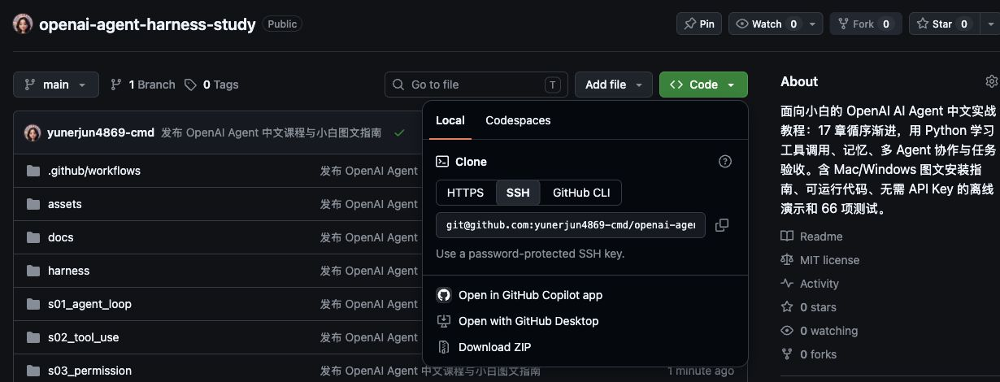

# 从零开始：下载项目并跑通第一课

这份指南写给第一次下载 GitHub 项目、第一次使用终端的读者。你可以先不注册 OpenAI API 账户、不填写密钥，跑通全部 17 章的离线演示，再决定是否接入真实模型。

**你要做的事情只有五步：安装 Python → 下载并解压项目 → 打开终端进入项目 → 安装依赖 → 运行第一课。**

## 1. 先弄清楚：这个项目是什么？

这是一个用 Python 编写的 **AI Agent 工程学习项目**。它通过 17 章中文讲义和可以运行的代码，解释 AI 如何请求工具、读取文件、执行任务，以及程序如何检查权限、保存进度和判断任务是否真的完成。

例如，“计算 17 加 25”在第一课中的过程是：模型请求 `add` 工具 → Python 执行加法 → 把结果交回模型 → 给出答案。后面的课程逐步增加文件操作、记忆、多 Agent 协作和失败恢复。

| 你可能遇到的词 | 在这里是什么意思 |
|---|---|
| Python | 运行本项目代码所需的软件；请安装 3.11 或更高版本 |
| 终端 / PowerShell | 输入文字命令、让电脑执行操作的窗口 |
| 命令 | 要粘贴到终端执行的一行文字；粘贴后按 Enter / 回车 |
| 依赖 | 本项目需要用到的其他 Python 软件包，例如 `openai` |
| 虚拟环境 `.venv` | 放在项目里的独立 Python 环境，用来安装本项目的依赖 |
| Agent | 围绕任务反复请求模型、执行工具、读取结果的程序 |
| Harness | 支撑 Agent 工作的工具、权限、状态、预算和验收机制 |
| API Key | 调用真实 OpenAI API 时使用的私人密钥；离线演示不用它 |
| `--demo` | 使用预设的模型回复演示流程；本地工具仍真实执行 |

本项目适合想了解 Agent 工作原理、刚学会 Python，或准备开发自己工具助手的人。即使暂时看不懂代码，也可以先按本指南运行示例；深入修改课程需要逐步学习 Python 的函数、字典和模块导入。

它是非官方教学实现，没有聊天网页界面，也不是 OpenAI Codex 的内部源码。

## 2. 准备电脑和项目

需要一台能安装 Python 的 Mac 或 Windows 电脑，以及安装依赖时可用的网络。**安装依赖会下载软件包；安装完成后的 `--demo` 课程不请求 OpenAI，也不产生模型调用费用。**

### 2.1 安装 Python

1. 打开 [Python 官方下载页](https://www.python.org/downloads/)。
2. 下载适合自己系统的 Python **3.11 或更高版本**。
3. 按安装器提示完成安装。Windows 安装器如果有 **Add Python to PATH** 选项，请勾选。
4. 如果安装前已经打开终端，请关闭后重新打开，让它识别新安装的软件。

已经安装 Python 的读者可以先按下方对应系统的步骤检查版本，符合要求就不用重新安装。

### 2.2 下载并解压项目

1. 打开 [本项目 GitHub 首页](https://github.com/yunerjun4869-cmd/openai-agent-harness-study)。
2. 找到文件列表右上方的绿色 **Code** 按钮。
3. 点击 **Code → Download ZIP**，下载压缩包。
4. Mac：在 Finder 中双击 ZIP 解压。Windows：右键 ZIP，选择 **全部解压缩 / Extract All**。
5. 打开解压后的文件夹，确认里面能看到 `README.md`、`run.py`、`requirements-dev.txt` 和 `s01_agent_loop`。

下图是本仓库的真实 GitHub 页面：先点绿色 **Code**，再点菜单底部的 **Download ZIP**。不用复制上面的 SSH 地址。



解压后的文件夹通常叫 `openai-agent-harness-study-main`。如果你重命名了它，也可以正常使用。**后文说的“项目文件夹”，始终指直接包含 `run.py` 的这一层。** Windows 解压时有时会多套一层同名目录，需要继续打开到能看到 `run.py` 为止。

不需要安装 Git，也不需要先下载参考的 Claude 项目。不要直接在 ZIP 预览窗口里运行代码。

## 3. Mac：第一次运行

如果你使用 Windows，请直接跳到 [第 4 节](#4-windows第一次运行)。下面每个代码框里，只复制命令本身，不要复制代码框边缘的符号。命令执行完、窗口重新出现可以输入文字的提示时，再执行下一条。

### 3.1 打开终端并进入项目文件夹

1. 按 `Command + 空格` 打开聚焦搜索，输入“终端”或 `Terminal`，打开它。
2. 在终端输入 `cd`，然后按一次空格键，先不要回车。
3. 在 Finder 中把刚才解压的**项目文件夹**拖进终端窗口。终端会自动填入它的路径。
4. 按回车。`cd` 的意思是“进入这个文件夹”。
5. 输入下面的命令并回车，确认这里有 `run.py`：

```bash
ls
```

如果看不到 `run.py`，说明进入了不对的目录，回到上一步重新拖入正确文件夹。

### 3.2 检查 Python 版本

```bash
python3 --version
```

预期显示类似 `Python 3.12.8` 的一行文字。版本号只要是 **3.11 或更高**即可，不必与示例完全一致。

### 3.3 创建独立环境

```bash
python3 -m venv .venv
```

成功时可能没有任何输出，这是正常的。它会在当前项目中创建 `.venv` 文件夹；这个步骤每个项目只需做一次。

### 3.4 安装项目依赖

```bash
.venv/bin/python -m pip install -r requirements-dev.txt
```

等待下载和安装结束，通常能看到 `Successfully installed` 或 `Requirement already satisfied`。需要多长时间取决于网络；红色 `ERROR` 表示需要排查。升级 pip 的提示通常不影响继续学习。

这里直接调用 `.venv` 里的 Python，因此不需要额外“激活环境”。后文继续使用同样的写法。

### 3.5 运行第一课

```bash
.venv/bin/python run.py s01 --demo
```

运行后继续看 [第 5 节：如何确认成功](#5-如何确认第一课运行成功)。

## 4. Windows：第一次运行

下面使用 PowerShell。每条命令粘贴后按回车，等它执行结束再输入下一条。

### 4.1 在项目文件夹中打开 PowerShell

1. 在文件资源管理器里打开**直接包含 `run.py` 的项目文件夹**。
2. 单击窗口顶部显示文件夹路径的**地址栏**，不要点右侧搜索框。
3. 输入 `powershell`，按回车。
4. 系统会在这个文件夹中打开 PowerShell。不同 Windows 版本可能把它显示在 Windows Terminal 的标签页里，后续命令相同。
5. 输入下面的命令并回车，确认列表中有 `run.py`：

```powershell
dir
```

如果看不到 `run.py`，关闭这个窗口，找到正确文件夹后重新打开。

### 4.2 检查 Python 版本

```powershell
py --version
```

预期显示 `Python 3.11.x` 或更高版本。如果提示找不到 `py`，尝试 `python --version`；如果后者显示符合要求的 Python 版本，下一步的 `py` 可以改成 `python`。两个都找不到时，请重新检查 Python 安装并重新打开 PowerShell。

### 4.3 创建独立环境

```powershell
py -m venv .venv
```

成功时通常不会打印长信息，而是回到可以输入命令的状态。项目中会出现 `.venv` 文件夹。电脑有多个 Python 版本且默认版本太旧时，可使用已安装的新版本，例如 `py -3.12 -m venv .venv`。

### 4.4 安装项目依赖

```powershell
.venv\Scripts\python.exe -m pip install -r requirements-dev.txt
```

等待安装结束。看到 `Successfully installed` 或 `Requirement already satisfied`，且没有安装失败的 `ERROR`，就可以继续。

本指南直接使用虚拟环境里的 `python.exe`，**不需要运行 `Activate.ps1`，也不需要修改 PowerShell 执行策略**。

### 4.5 运行第一课

```powershell
.venv\Scripts\python.exe run.py s01 --demo
```

## 5. 如何确认第一课运行成功？

第一课的实际离线输出如下：

```text
正在运行 s01_agent_loop
[离线演示] 模型响应为预设脚本；工具在本地真实执行，不产生 API 费用。
[工具] add → 成功
[状态] completed
工具返回 sum=42，所以答案是 42。
[用量] {"input_tokens": 0, "output_tokens": 0, "requests": 2, "tool_calls": 1}
```


| 输出内容 | 你可以怎样理解 |
|---|---|
| `[离线演示]` | 当前模型回复来自固定脚本，没有请求真实 OpenAI |
| `[工具] add → 成功` | Python 中的加法函数真实运行了 |
| `[状态] completed` | 本轮工具会话已经正常结束 |
| `答案是 42` | 示例中的 `17 + 25` 得到了正确结果 |
| `requests: 2` | 演示脚本模拟了两轮模型响应，不是两次收费 API 请求 |

看到了这些内容，你就已经跑通第一课。**你不需要输入 API Key，也不需要先修改源码。**

## 6. 第二次打开项目，还需要重装吗？

不需要每次创建虚拟环境或安装依赖。保留整个项目文件夹，下次只需要：

1. 按自己系统上面的方式打开终端，进入直接包含 `run.py` 的项目文件夹。
2. 使用对应系统的命令运行课程。

| 操作 | Mac 终端 | Windows PowerShell |
|---|---|---|
| 重跑第一课 | `.venv/bin/python run.py s01 --demo` | `.venv\Scripts\python.exe run.py s01 --demo` |
| 查看课程编号 | `.venv/bin/python run.py --list` | `.venv\Scripts\python.exe run.py --list` |
| 运行第二课 | `.venv/bin/python run.py s02 --demo` | `.venv\Scripts\python.exe run.py s02 --demo` |
| 运行所有离线示例 | `.venv/bin/python run.py all --demo` | `.venv\Scripts\python.exe run.py all --demo` |

如果把项目搬到另一台电脑、重新下载了一份，或者移动后原来的虚拟环境无法使用，请在新位置重新创建 `.venv` 并安装依赖。不要把别人的 `.venv` 文件夹直接复制过来当作自己的环境。

## 7. 按什么顺序学习？

推荐每章重复这个过程：**先读中文讲义 → 运行该章 `--demo` → 对照输出读 `code.py` → 按讲义追读 `harness/` 中的公共实现 → 做一道练习**。

| 阶段 | 章节 | 重点 |
|---|---|---|
| 先理解基本循环 | s01–s04 | 工具调用、参数验证、权限与 Hooks |
| 让 Agent 管理更长任务 | s05–s09 | 计划、子 Agent、技能、上下文与记忆 |
| 保存状态并协调任务 | s10–s14 | 任务系统、后台执行、调度、协作与远程 MCP |
| 把能力组合起来 | s15–s17 | 集成实践、失败后恢复、根据证据验收目标 |

完整阅读入口：[17 章课程目录](../SUMMARY.md)。第一课讲义：[s01 · Agent 循环](../s01_agent_loop/README.md)。

章节里的命令有时用 `python ...` 作为简写。没有激活环境时，把开头的 `python` 换成 Mac 的 `.venv/bin/python` 或 Windows 的 `.venv\Scripts\python.exe`。**文档、文件夹和代码里的 `s01` 是“字母 s + 数字 01”；第二课是 `s02`，以此类推到 `s17`。**

可以先运行一次全部演示，检查安装是否完整。它会逐章输出，不会停在第一课；最后正常显示：

```text
离线验收：17/17 章通过；失败：[]
```


`--demo` 的模型回复是固定脚本，所以随意修改提示词不一定改变演示内容。后面的章节会真实创建本地文件、数据库或执行课程定义的本地工作；“离线”表示不调用 OpenAI，不表示对电脑完全没有写入。

特别推荐运行 s17：它第一次故意写错结果，虽然脚本中的模型说“完成”，程序仍检查出错误；第二轮修复后才通过。你会看到目标状态 `completed`、`rounds=2`，并看到失败和成功的证据。


示例产物默认放在项目的 `.workspaces/` 目录中。Mac Finder 默认隐藏以点开头的文件夹，可按 `Command + Shift + .` 显示。各章的具体文件和行为以该章讲义为准。

## 8. 可选：接入真实 OpenAI 模型

**这一节可以完全跳过。** 只有希望实际让模型选择工具、尝试自己的问题时，才需要配置真实 API。

API 是程序访问模型服务的接口；API Key 是访问凭证。真实请求需要你的 OpenAI API 账户具有所选模型的访问权限，并遵循该账户当前的计费与额度设置。本教程不承诺某个账户或订阅自动包含这些权限。

### 8.1 创建本地配置文件

在项目文件夹的终端运行对应系统的一组命令：

Mac：

```bash
cp .env.example .env
open -e .env
```

Windows PowerShell：

```powershell
Copy-Item .env.example .env
notepad .env
```

这会把示例配置复制成真正读取的 `.env`，然后用文本编辑器打开。**如果之前已经配置过 `.env`，直接执行第二行打开即可，不要再次复制覆盖自己的设置。**

### 8.2 填写密钥与模型

1. 在自己的 [OpenAI API 控制台](https://platform.openai.com/) 中管理 API 凭证和模型访问。
2. 找到 `.env` 的 `OPENAI_API_KEY=` 这一行，把密钥填在等号后面。
3. 找到 `OPENAI_MODEL=` 这一行，保留示例值，或改为**你的 API 账户可用且支持 Responses 工具调用的模型名称**。
4. 保存文件，然后关闭编辑器。

示意内容如下；中文说明是占位文字，不要原样填写：

```dotenv
OPENAI_API_KEY=这里替换成你的真实密钥
OPENAI_MODEL=这里替换成账户可用的模型名称
```

`.env.example` 中的模型名是配置示例，不代表你的账户一定有权限。其余配置暂时保持原样；第一课不需要配置 MCP，也不需要修改 `OPENAI_BASE_URL`。

文件名必须是 `.env`，不要变成 `.env.txt`。Windows 保存后可以在资源管理器中开启“文件扩展名”显示以确认。项目只读取根目录里的 `.env`，不要把它放进 `s01_agent_loop`。

**密钥不要发到聊天、截图、GitHub Issue 或 README 中。** 项目已用 `.gitignore` 排除 `.env`，仍应在分享文件前检查内容；尤其不要把包含密钥的配置编辑器截进运行截图。

### 8.3 去掉 `--demo`，执行真实请求

Mac：

```bash
.venv/bin/python run.py s01
```

Windows PowerShell：

```powershell
.venv\Scripts\python.exe run.py s01
```

这时会调用真实 API，需要网络，可能产生账户费用；回答文字和工具选择可能与离线截图不同。成功调用不会出现“模型响应为预设脚本”的标识；遇到 API 错误会报告失败，不会自动冒充离线成功。

自定义任务可在命令末尾追加 `--prompt "请调用 add 计算 120 加 360"`。例如 Mac：

```bash
.venv/bin/python run.py s01 --prompt "请调用 add 计算 120 加 360"
```

Windows 使用同样的参数，把开头换成 `.venv\Scripts\python.exe` 即可。请逐章尝试真实模式；`all` 只支持 `--demo`，防止一次启动所有章节的真实请求。

模型请求修改文件或运行受保护工具时，默认需要宿主授权。在交互终端里，程序会展示具体工具参数并询问，确认理解操作后输入 `y`。课程中的 `--allow-write` 会预先授权该章提供的写入或命令工具，第一次学习不必盲目加上。宿主自身仍可能初始化目录、数据库，或执行章节定义的工作流写入；它与模型工具授权是不同机制。

第 14 课的真实远程 MCP 还需要可信的 HTTPS MCP 服务地址，照该章说明单独配置即可；先完成基础课更容易理解。

## 9. 常见问题：看到什么，下一步怎么做？

| 现象 | 通常的原因 | 处理方法 |
|---|---|---|
| `command not found: python3`，或找不到 `py` / `python` | Python 没装好，或旧终端没刷新环境 | 完成安装后关闭并重开终端，再检查版本；Windows 可尝试 `python --version` |
| 显示需要 Python 3.11 或更高 | 当前命令用的是旧 Python | 安装新版本，并用新版本重新创建 `.venv` |
| 找不到 `run.py` 或 `requirements-dev.txt` | 终端不在项目根目录 | Mac 用 `ls`、Windows 用 `dir` 检查，进入直接包含 `run.py` 的目录 |
| 找不到 `.venv/bin/python` 或 `.venv\Scripts\python.exe` | 虚拟环境没创建成功，或用错系统命令 | 先确认项目路径，再执行自己系统的创建环境步骤 |
| `No module named openai` / `dotenv` / `jsonschema` / `pytest` | 依赖装进了别的 Python，或安装失败 | 使用本指南的 `.venv` Python 重新执行 `-m pip install -r requirements-dev.txt` |
| PowerShell 提示禁止运行脚本 | 使用了环境激活脚本 | 直接使用 `.venv\Scripts\python.exe`，不需要激活 |
| 安装时出现超时、连接失败或下载失败 | 网络无法访问软件包下载服务 | 检查网络后重试安装；不要忽略失败后直接运行课程 |
| `未设置 OPENAI_API_KEY` | 去掉了 `--demo`，但还没填密钥 | 想先学习就加回 `--demo`；要真实调用就按第 8 节配置 |
| 已填 `.env` 却读取不到 | 文件名、位置或已设置的系统环境变量不对 | 检查文件是否是根目录 `.env`；系统已有同名环境变量时优先于 `.env` |
| API 返回 `401` | 凭证被服务拒绝 | 核对自己的密钥及其有效性，不要公开粘贴密钥排错 |
| API 返回模型不存在或无权限 | 模型名或账户权限不匹配 | 对照 API 控制台检查 `OPENAI_MODEL` 与模型访问权限 |
| API 返回 `429` | 请求速率或账户额度限制 | 阅读具体错误信息，在控制台检查限制和额度后处理 |
| `permission_denied` 或操作被拒绝 | 模型工具请求未获授权 | 阅读展示的操作参数；需要时在交互提示中确认，并参考该章说明 |
| 第一课成功，另一个章节失败 | 不同章节依赖的行为不同 | 保留失败章节名和完整错误文字，单独重跑该章，并查看对应讲义 |

如果要反馈问题，请提供操作系统、Python 版本、执行的命令和完整错误文字；截图应包含命令与错误，但不要包含密钥。能复制文字时，文字比只拍一张截断截图更方便定位。

## 10. 想进一步验证和读源码

安装的是 `requirements-dev.txt` 时，也可以运行项目测试。Mac 使用 `.venv/bin/python -m pytest -q`，Windows 命令写法为 `.venv\Scripts\python.exe -m pytest -q`。实际已验证的环境、结果和未覆盖范围见 [验证记录](VALIDATION.md)，不要把命令示例理解为已经在所有系统上验收通过。

| 下一步 | 阅读入口 |
|---|---|
| 按顺序学完 17 章 | [课程目录](../SUMMARY.md) |
| 看每个公共模块负责什么 | [架构与源码导航](ARCHITECTURE.md) |
| 理解为什么不能只把 Claude SDK 改个名字 | [Anthropic → OpenAI 协议对照](MIGRATION.md) |
| 查证 API 协议来源 | [官方来源](SOURCES.md) |
| 了解本地执行与恢复能力的范围 | [运行边界](LIMITATIONS.md) |
| 返回项目首页 | [README](../README.md) |
